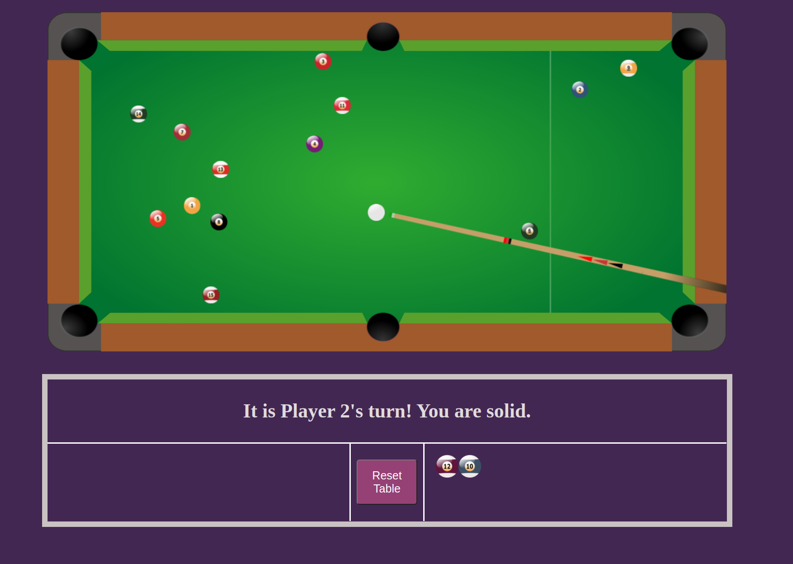

# JS Billiards 

[Try the demo here!](https://cptleo92.github.io/JSBilliards/)

Fun fact: the names *billiards* and *pool* are generally used interchangeably these days, but they in fact refer to different variations of the table game, much like snooker is a completely different game. I believe this game is technically called pocket billiards.

## About This Project
JS Billiards, as the name implies, is a browser implementation of pool written in Javascript using HTML and Canvas. The game features a simple yet intuitive mouse-only control system with realistic animations and collision logic.

Upon opening the demo page, you will be greeted with instructions on how to play. After clicking through the info, the game loads in. Player 1 breaks, and the game continues until the 8 ball is pocketed. The info box below the table displays which balls have been pocketed, as well as a button to reset the game at any time. 

## Timeline
##### Day 1
I used canvas to set up a very simple table with balls just to get the physics down. I followed [this tutorial](https://spicyyoghurt.com/tutorials/html5-javascript-game-development/collision-detection-physics) to get the ball rolling (ha!). 

##### Day 2
Still working on collision. Math is hard! I found [this resource](http://www.jeffreythompson.org/collision-detection/table_of_contents.php) which ended up being immensely helpful. Still running into the issue where if an object moves too fast it "jumps" over a potential collision. 

##### Day 3-4
Leaving collision alone for now to get the main game loop done. Apart from dropped frames and weird collisions/edge cases, this is now a fully functional game of pool! 

##### Day 5-6
Cue stick controls implemented. I have a pool stick that follows the mouse to set a shot angle and a click/hold/release system to determine the power of the shot. 

##### Day 7
Simple start screen with instructions added, as well as a reset button that will start a new game. 

## Upcoming Features
* Choices between 8-ball and 9-ball game modes
* "Pool with Powers" - special game mode where each player starts with a "power" that they may use once during the game. Powers will include:
  * Teleport Ball: the first ball that the cue ball comes into contact with will be removed and placed at a random location on the table. The cue ball will continue moving as if the ball was never there.
  * Blunt Tip: on your opponent's next shot, their spin will be completely random.
  * Free Scratch: you are allowed a scratch on this turn. But if the cue ball ends up in a pocket, your opponent gets ball in hand anyway.
  * And many more!
* AI players
* Better graphics 
* Music/sound

## Contact Me
Leo Cheng // [LinkedIn](http://www.linkedin.com/in/sirleoc) // [Email](leo.cheng92@gmail.com)

## Credits
**Resources**
 
[spicyyoghurt.com - Collision Detection Physics](https://spicyyoghurt.com/tutorials/html5-javascript-game-development/collision-detection-physics)
 
[jeffreythompson.org - Collision Detection](http://www.jeffreythompson.org/collision-detection/table_of_contents.php)

**Art**
 
[Game_assets_66](https://opengameart.org/content/8-ball-pool-assets)